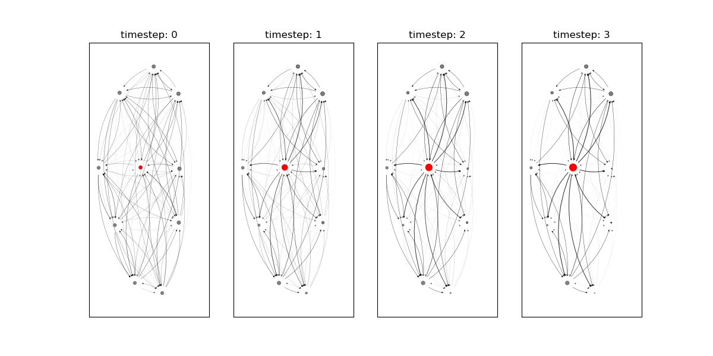

## Networks Via Diffusion

This repository contains the working code relevant for Max Bromberg's physics master's thesis, the objective of which is to discover the dependence of network structure on the forms of (presumably information) diffusion. 

Supervised by [Dr. Philipp Lorenz-Spreen][1] of the Max Planck Institute for Human Development ([Max Planck Institut für Bildungsforschung][2]) and [Prof. Roland Netz][3] of Freie Universität Berlin.

<!---- Links: ---->
[1]: https://www.mpib-berlin.mpg.de/staff/philipp-lorenz-spreen
[2]: https://www.mpib-berlin.mpg.de/de
[3]: https://www.physik.fu-berlin.de/en/einrichtungen/ag/ag-netz/mitarbeiter/Professors/netz_roland/index.html


### Hierarchy Coordinates

Independent of the rest of this repository is an implementation of [Hierarchy Coordinates][0.2] for weighted graphs, which may be used in isolation. 
Originally formulated exclusively for unweighted directed networks<sup id="a1">[0.1](#f1)</sup> by Corominas-Murta et al. (2013) in _On the Origins of Hierarchy in Complex Networks_, and subsequently implemented in Matlab v7, [hierarchy_coordinates.py][0.2] provides a python3 implementation which includes weighted networks. 
![An illustration of linear vs exponential threshold distributions (right) and the corresponding unweighted networks created from them (left). For details regarding the adaptation from unweighted to weighted networks, see the [associated thesis][0.5]](./readme_graphics/Threshold_Explainations.png)
Calculation of hierarchy coordinates for weighted networks are performed simply by reducing weighted networks to a set of unweighted networks based on either exponentially or linearly distributed thresholds, and subsequently averaging their hierarchy coordinates as given by the original algorithm described in their [appendix][0.3].

There are a variety of functions required for the calculation of hierarchy coordinates, including initially reducing a simple, directed graph into a node weighted Directed Acyclic Graph (DAG), and thereafter making use of:
 _max_min_layers_, *(recursive)_leaf_removal*, *graph_entropy*, and the base hierarchy coordinate functions<sup id="a2">[0.2](#f2)</sup>. Naturally all may be used independently, or for the common purpose of simply finding the hierarchy coordinates of a given graph (including a binary graph, for which the thresholds are not used) one may simply use _hierarchy_coordinates.average_hierarchy_coordinates_, as in this example code:
```
import numpy as np
import hierarchy_coordinates as hc

Adjacency_Matrix = np.random.rand(10, 10)
orderability, feedforwardness, treeness = hc.average_hierarchy_coordinates(Adjacency_Matrix)
```
Furthermore, for plotting of hierarchy coordinates with 2d planes printed below, one may use the [plotter.py][5] *general_3d_data_plot* function, as below.

<!---- References: ---->
[0.1]: https://arxiv.org/abs/1303.2503
[0.2]: hierarchy_coordinates.py
[0.3]: https://www.pnas.org/content/suppl/2013/07/25/1300832110.DCSupplemental
[0.5]: Emergence%20of%20Hierarchy%20via%20Local%20Adaptation%20to%20Diffusion.pdf

<!---- Footnotes: ---->
<b id="f1">0.1</b> Supplementary material of [Corominas-Murta et al. (2013)][0.1] with detailed description of the hierarchy coordinates used to develop this repository's [hierarchy_coordinates.py][0.2] found [here][0.3]

<b id="f2">0.2</b> Feedforwardness and treeness are calculated through recursive application of the same 'base' version of their respective functions _feedforwardnes_iteration_ and  _single_graph_treeness_. [↩](#a2)

### Efficiency Coordinates
**Note: Implementation pending further analysis, as normalization does not presently yield expected (0, 1)<sup>2</sup> range**

This repository also contains an implementation of the efficiency coordinates as explored in [Goñi et al. (2013)][1.1] *Exploring the morphospace of communication efficiency in complex networks*, and initially developed in [Latora et Marchiori (2001)][1.4], which considers both *global*, or *routing* efficiency (E<sub>rout</sub>) and diffusion efficiency (E<sub>diff</sub>). 
Routing efficiencies consider the relative efficiency of intra-network communication via shortest possible path's (implying global knowledge, parallel processing) whereas diffusion efficiency<sup id="a1.0">[1.0](#f1.0)</sup> considers the comparable efficacy of information passing via pure diffusion. 

The efficiency coordinates require only an adjacency (numpy) matrix (which will be row normalized if not already normalized) and the normalization option normalizes the efficiency coordinates according to the method in [Goñi et al. (2013)][1.1].
```
import efficiency_coordinates as ef
import numpy as np

A = np.random.rand(10, 10)  # Declaring Adjacency Matrix
E_diff, E_rout = ef.network_efficiencies(A, normalize=True)

# Equivalent to:
E_diff, E_rout = ef.E_diff(A), ef.E_rout(A)
```


<!---- References: ---->
[1.0]: https://pubmed.ncbi.nlm.nih.gov/23505455/
[1.1]: efficiency_coordinates.py
[1.2]: http://www.uvm.edu/pdodds/files/papers/others/2001/latora2001a.pdf
[1.3]: https://arxiv.org/abs/1608.06201
[1.4]: http://www.uvm.edu/pdodds/files/papers/others/2001/latora2001a.pdf

<!---- Footnotes: ---->
<b id="f1.0">1.1</b> Diffusive efficiency makes use of the random walker effective distance (explored in [Iannelli et al. 2017][1.3]), which is a handy method whereby with maximal computational demands of matrix inversion **~O(n<sup>2.5</sup>)** yields the random walker probabilities between all nodes in a network. [↩](#a1.0)

### Using the Migrating Meme Model

Though [graph.py][4] encompasses the mechanics of the simulation itself, and its internal documentation is intended to clarify the purpose of its component functions, those wishing to simply run simulations with a given model configuration and parameter combination need not interact with the file directly.

##### Individual Simulations
For singular simulations, it is recommended to familiarize oneself with the possible parameter variations defined in the initialization of [graph.py][4], though as all but number of nodes is given as a default argument, one may readily learn by simply initializing a graph class object with a given number of nodes, selectivity and edge_conservation, initializing its structure, and subsequently simulating and plotting.
A most basic [example][7]:
```
import graph
import plotter

edge_conservation = 0.15  # Between (0, 1), determines node's willingness to adapt edges
selectivity = 0.75  # Between (0, 1), determines % edges/node rewarded
n = 10

G = graph.Graph(n, edge_conservation, selectivity)
G.uniform_random_edge_init()
G.simulate(num_runs=4, constant_source_node=2)

plotter.plot_network(G, show=True)
```

The [plotter.py][5] file contains many preformatted, relevant plotting functions for a given network, from effective distance evolution and edge distribution histograms to grid search heatmaps and network evolution animations. 
Nearly all [plotter.py][5] functions accept a graph class object as their first argument, and can either be directly shown via setting `show=True` or saved via `title='/path/to/file/file_title'`. 

Note that for ensemble simulations (i.e. using `G.simulate_ensemble(num_simulations=10, num_runs_per_sim=100, edge_init=1.2)`) one needs to use the `edge_init` parameter<sup id="a2.1">[2.1](#f2.1)</sup>, to determine the edge initialization for each simulation.
Furthermore, the final adjacency matrix is an average of all simulations, which makes sense for some observables, as in effective distance, but doesn't make much sense for visualizing network graphs. 


##### Grid Searches
If it's grid searches y'er afta',  [grid_search_control.py][6] allows for all possible model configurations for grid searches over selectivity and edge conservation parameters, as well as a selection of resultant graphs.
Adjust directory variable to intended output directory, and then shift model configuration via adjustments to the default configuration dictionary like so:

` example_configuration_dict = {**default_dict, edge_init: 1.2} `

Where here the _example_configuration_dict_ has shifted the grid search to run with _edge_init_ value of 1.2, instead of the default (See the globally defined default dictionaries _parameter_dic_, _search_wide_dic_, _edge_init_, _ensemble_params_, and _plots_ to learn what the default configuration parameters are and their effect)

If multiple grid searches are intended, they may be strung together as a list of dictionaries as a _master_dict_ and run sequentially via a loop,
```
if __name__ == '__main__':
for i in range(len(master_dict)):
    run_grid_search(param_dic=master_dict[i])
```
 or else in parallel via accepting a system arg indexing through the _master_dict_, as potentially in the case of cluster computing, e.g.
```
if __name__ == '__main__':
    run_grid_search(param_dic=master_dict[int(sys.argv[1])])
```
When wishing to vary network initialization, seeding or binaries, one may make use of the _list_of_dicts_ function, which combinatorically combines all alterations listed through other dictionaries and graphs them onto a 'base dictionary' of common features.
Thus if the entire space of varying initial network structure, seeding and mechanics is to be explored, then one may simply enter their intended 'base dictionary' as the initial argument to the _list_of_dicts_ function, and then use the subsequent functions 
_initializations_dic_, _seeding_dic_, _directionality_dic_ to generate all combinations of initial structures, seeding and mechanics, respectively, e.g.
```
master_dict = list_of_dicts(default_dict, initializations_dic(directory), seeding_dic(directory), directionality_dic(directory))
```
Note that for cluster computing, it may be necessary to turn off the Xwindows backend of matplotlib via uncommenting line 3 of [plotter.py][5], `matplotlib.use('Agg')`, disabling matplotlib graph displays.

<!---- References: ---->
[4]: graph.py
[5]: plotter.py
[6]: grid_search_control.py
[7]: example_simulation.py


<!---- Footnotes: ---->
<b id="f2.1">2.1</b> edge_init determines initial network structure based on data type, `None` is uniform rnd, `int` is num_edges/node in sparse init, `float` is degree exp in scale free init. [↩](#a2.1)
